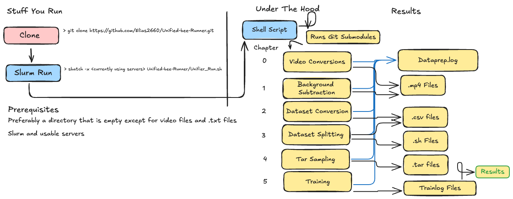

# Unified Bee Runner

Unified Bee Runner is a pipeline for processing and analyzing bee-related datasets. This project includes several steps such as dataset creation, video conversion, data splitting, and model training. The model is meant to run on ilab, and through slurm, and for the Behavioral Analysis project at [Rutgers WINLAB](https://www.winlab.rutgers.edu/).

This is mean to unify all the code that has been created for the [project (2024 presentation attached)](https://docs.google.com/presentation/d/1j25c85SZ_8YPYvNdfubfVlN3Zx5B-090/edit?usp=sharing&ouid=110217722607110726120&rtpof=true&sd=true).

## Pipeline



## Table of Contents

- [Installation](#installation)
- [Usage](#usage)
- [Pipeline Steps](#pipeline-steps)
- [Contributing](#contributing)
- [License](#license)

## Installation

1. Clone the repository:

   ```sh
   git clone https://github.com/Elias2660/Unified-bee-Runner.git
   ```

If there is a branch that you want to use, you can simply checkout to the branch that you choose.

## Usage

<!-- To run the pipeline, use the provided [shell script](Unifier_Run.sh) in [SLURM](https://slurm.schedmd.com/documentation.html). If you don't want to, (this is not recommended though) you can execute it in your command line, though this will take a while:

**NOTE**: Do not `cd` into the `Unified-Bee-Runner` dir to run with default settings. They are configured to run in the dir containing the data. Your file structure should look like when you run the commands (you should be in data_dir): -->

### Quick Start

The most easy way to run the runner is to run it directly in the directory that contains the data. After cloning, your directory should look something like this:

```
data_dir
├── Unified_bee_Runner
├── d1.mp4
├── d2.mp4
├── d3.mp4
├── logNo.txt
└── logPos.txt
```

To run with default settings, you can run the [`Slurm_Run.sh`](Slurm_Run.sh) file, which has preset sbatch settings (this is in the `data_dir`):

```sh
./Unified-bee-Runner/Slurm_Run.sh
```

Run `squeue -u <user>` to be able to find your current jobs and the servers that they are running on. If you don't see that job, try again and if it doesn't work again, the check the slurm troubleshooting guide.

### More advanced usage

For more advanced usage, you can checkout the [`Unifier_Run.sh`](Unifier_Run.sh) file, which contains most of the settings that are used in the pipeline. To see a more advanced list, you can also check out the [`ArgParser.py`](ArgParser.py) file that has all the possible settings that can be used. **Not all of them work and this pipeline is still working through many bugs.**

The most important settings that you can change are:

- `--number-of-samples`: the max number of samples that the sampler will aim to extract from each video
- `--max-workers-video-sampling`: the number of concurrent videos that you can sample with
- `--frames-per-sample`: the number of frames that will be used by the model for each sample for concurrence.

Additionally, the `INPUT_PATH` and `OUTPUT_PATH` variables, both in [`Unifier_Run.sh`](Unifier_Run.sh) can be edited to change the where the runner will look for input and output the experiment results.

Changing the `slurm` settings can be helpful. Updating memory could be dangerous unless you are knowledgeable of the workflow, but using the `-x` and an ilab server that seems full could help your job not get canceled.

### Config files

This pipeline automatically generates a `config.log` file inside the `Unified-bee-Runner` dir. The pipeline automatically looks inside the dir in order to find the file, but if it doesn't it uses the arguments passed in the [`Unifier_Run.sh`](Unifier_Run.sh) file. You can copy the config file into the `Unified-bee-Runner` across runs in order to use the same setting.


## Slurm Troubleshooting

If you slurm job keeps dying, then the easiest way to fix that problem is the reduce memory, which can most often be done by reducing `--max-workers-video-sampling` argument in [`Unifier_Run.sh`](Unifier_Run.sh) and the `--mem=` command in [`Slurm_Run.sh`](Slurm_Run.sh). Usually you can reduce the argument to around 500GB without changing the `--max-workers-video-sampling` argument. Otherwise, you should reduce by one for the `--max-workers-video-sampling` argument for each ~100 GB you remove. You can also remove / decrease the `-n`, `-c`, `-G` arguments, but that might slow stuff down.

## Pipeline Steps

This is run using the chapter system, so you can choose the specific steps that are used here by editing the `--start` and `--end` commands, which are by default respectively set at 0 and 6, which will run the entire model.

0. [`Video Conversion and Counting`](https://github.com/Elias2660/Video_Frame_Counter): Converts .h264 videos to .mp4 format and creates counts.csv.
1. [`Background Subtraction`](https://github.com/Elias2660/Video_Subtractions): Applies background subtraction to the video frames to isolate the bees
2. [`Dataset Creation`](https://github.com/Elias2660/Dataset_Creator): Creates the dataset.csv
3. [`Data Splitting`](https://github.com/Elias2660/working_bee_analysis/blob/main/make_validation_training.py): Splits the data into training and testing sets
4. [`Video Sampling`](https://github.com/Elias2660/VideoSamplerRewrite): Clones the VideoSamplerRewrite repository and samples the video frames
5. [`Model Training`](https://github.com/bfirner/bee_analysis/blob/main/VidActRecTrain.py): Runs the model training script

## Cropping Arguments

You can choose specific cropping arguments by editing the `--crop`, `crop_x_offset`, `crop_y_offset`, `--out-width`, and `--out-height`.
The initial offset coords are in the center of the image.

`Y offset:` Negative makes it higher while positive makes it lower
`X offset:` Positive moves it right while negative moves it left
`Out-width:` The width of the cropped image
`Out-height:` The height of the cropped image

## Other Stuff

This projects has other project submodules in the [non_workflow_links](non_workflow_links/) directory, which relate to other parts of the bee project.

## Contributing

[Contributions](CONTRIBUTING.md) are welcome! Please open an issue or submit a pull request.

## Code of Conduct

Please note that this project is released with a [Contributor Code of Conduct](CODE_OF_CONDUCT.md). By participating in this project you agree to abide by its terms.

## [Security Policy](SECURITY.md)

### Reporting a Vulnerability

If you discover a security vulnerability within this project, please report it. We will respond to your report promptly and work with you to understand and address the issue.

## License

This project is licensed under the [MIT License](LICENSE).
